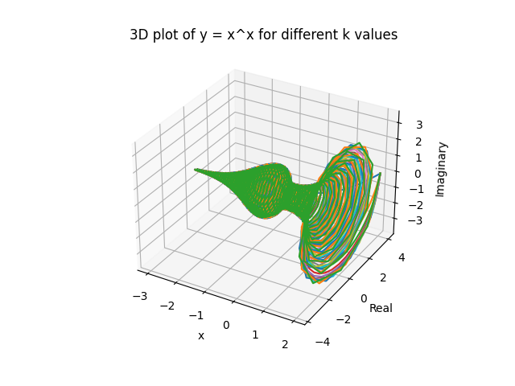
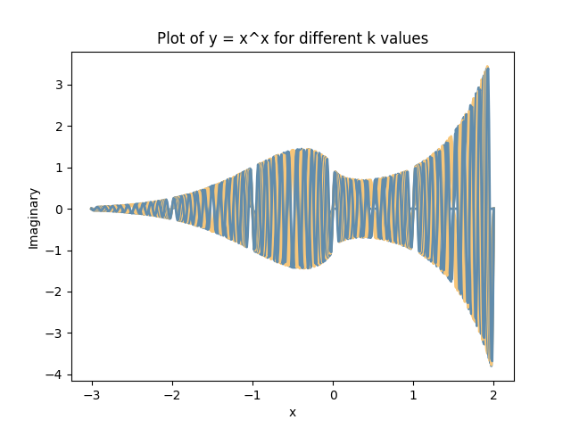

# x-power-x: a complex story

This project aims to visualize the function $y = x^x$ in the complex plane and explain the math behind the generation. My approach to this problem is mostly inspired by [李永乐老师@tchliyongle](https://www.youtube.com/watch?v=6HYZWVYv0WY), a prominent science popularizer and educational video creator from China.

## Mathematical Background

TODO

## Files

- `x-power-x.py`: This is the main Python script that generates the visualizations.

## Visualizations

The script generates two types of visualizations:

1. A 3D plot of the real and imaginary parts of y = x^x for different k values. This plot shows how the function behaves in the complex plane.

   

2. A 2D plot of the imaginary part of y = x^x against x for different k values. This plot shows how the imaginary part of the function changes with x.

   

## Usage

To generate the visualizations, simply run the `x-power-x.py` script:

```bash
python x-power-x.py
```

## Dependencies

This script requires the following Python libraries, which are listed in the `requirements.txt` file:

- NumPy
- Matplotlib

You can install these libraries using pip:

```bash
pip install -r requirements.txt
```

## How it works

TODO

## Exploration and Collaboration

This is one of my math explorations that delve into the complex behavior of the function $y=x^x$. I invite you to join me in this exciting journey by experimenting with the code, tweaking parameters, and observing the fascinating outcomes.

If you have any suggestions for improving the project, intriguing observations to share, or you encounter any issues while using the code, please let me know. You can submit your suggestions, feedback, or bug reports as issues/pull requests right here on this repository. I value your input and am eager to collaborate with you to make this project even better.

Feel free to reach out to me at patricsu3675@gmail.com and let us unlock more hidden wonders of mathematics
